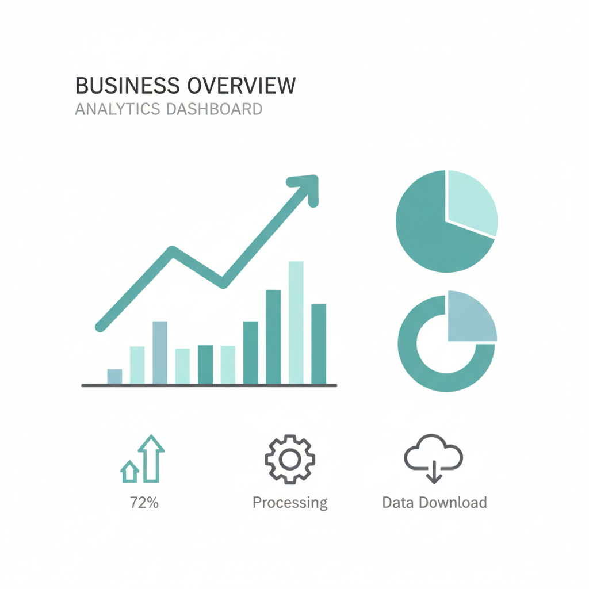
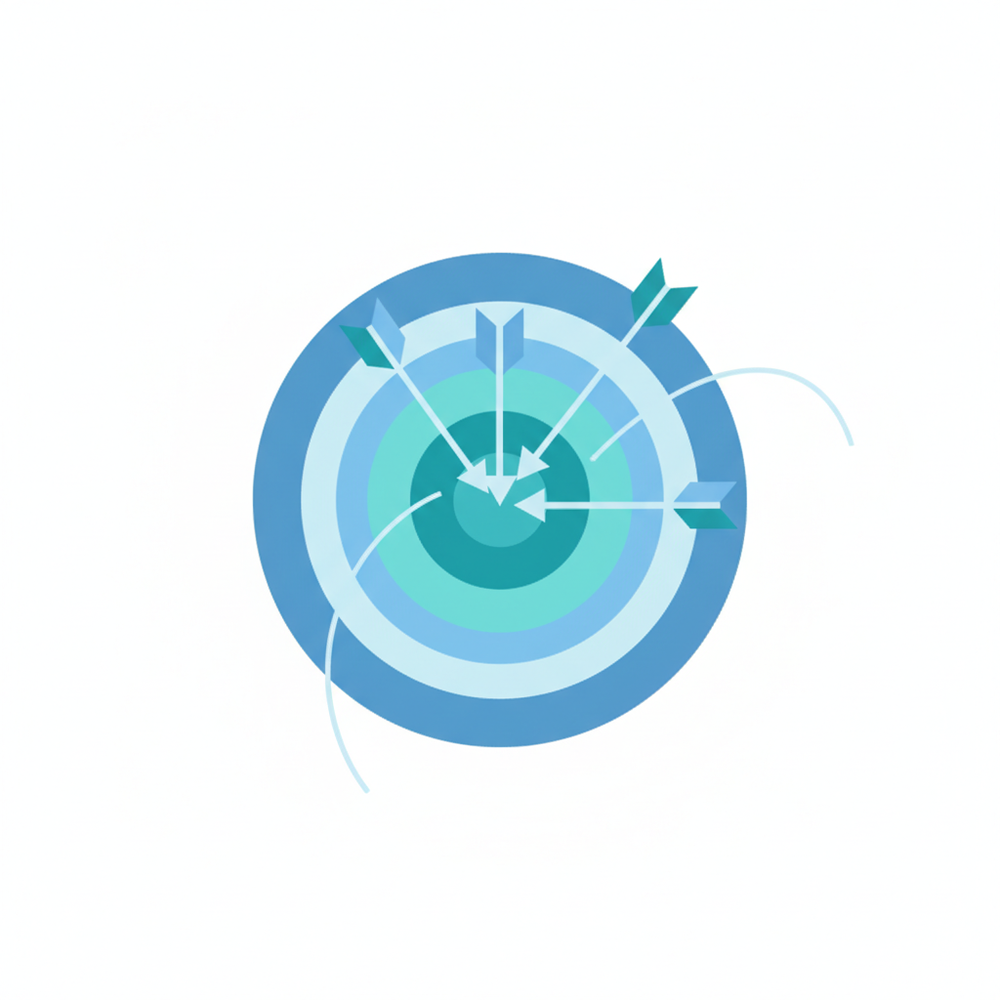

<!-- _backgroundImage: "linear-gradient(to right, #0D7050, #3DB88A)" -->
<!-- _color: #fff -->
<!-- _paginate: false -->

# レイアウトパターン見本市

## スタイルガイド準拠の40パターン

**フェアプレイス株式会社**

---

# 目次

## A. タイトル・セクション系

1. タイトルスライド
2. セクション開始
3. セクション終了・まとめ
4. 目次スライド
5. クロージングスライド

## B. カラムレイアウト系

6. 2カラム比較（Before/After）
7. 2カラム対比
8. 3カラムレイアウト（等幅）
9. 3カラム（アクセントカラー）
10. 4カラムレイアウト

11. 5カラム（成熟度レベル）
12. 2x2グリッド
13. 2x3グリッド

## C. 縦並びリスト系

14. 縦3つステップ
15. 番号付きステップ
16. タイムライン
17. アイコン付きリスト

---

<!-- _backgroundImage: "linear-gradient(to right, #0D7050, #3DB88A)" -->
<!-- _color: #fff -->

# A. タイトル・セクション系

プレゼンテーションの構造を作る基本パターン

---

<!-- _backgroundImage: "linear-gradient(to right, #0D7050, #3DB88A)" -->
<!-- _color: #fff -->
<!-- _paginate: false -->

# 1. タイトルスライド

## サブタイトルがここに入ります

**フェアプレイス株式会社 代表 岩﨑喬**

---

<!-- _backgroundImage: "linear-gradient(to right, #0D7050, #3DB88A)" -->
<!-- _color: #fff -->

# 2. セクション開始スライド

## 新しい章の始まりを印象づける

第1章 セクションタイトル

セクションの補足説明文がここに入ります

---

<!-- _backgroundImage: "linear-gradient(to right, #D4F2E7, #F2FAF7)" -->

# 3. セクション終了・まとめ

## 章の要点を整理して次へつなげる

1. まとめポイント1がここに入ります
2. まとめポイント2がここに入ります
3. まとめポイント3がここに入ります

次章への導入文がここに入ります

---

# 4. 目次スライド

## 講演全体の構成を示す

  <h1 class="text-em-xl font-bold text-[#1A1A2E] mb-3">第1章</h1>
  
章タイトル

  
補足説明文

  <h1 class="text-em-xl font-bold text-[#1A1A2E] mb-3">第2章</h1>
  
章タイトル

  
補足説明文

  <h1 class="text-em-xl font-bold text-[#1A1A2E] mb-3">第3章</h1>
  
章タイトル

  
補足説明文

---

<!-- _backgroundImage: "linear-gradient(to right, #0D7050, #3DB88A)" -->
<!-- _color: #fff -->

# 5. クロージングスライド

## 感謝と連絡先を伝える

ご清聴ありがとうございました

お問い合わせ: sample@example.com

---

<!-- _backgroundImage: "linear-gradient(to right, #0D7050, #3DB88A)" -->
<!-- _color: #fff -->

# B. カラムレイアウト系

情報を横に並べて比較・対比するパターン

---

# 6. 2カラム比較（Before/After）

## 変化を左右で対比させるパターン

  

    <h1 class="text-em-2xl font-bold mb-4 text-[#1A1A2E]">Before</h1>
    <ul class="text-em-lg space-y-3 text-[#1A1A2E]">
      <li>山路を登りながら</li>
      <li>智に働けば角が立つ</li>
      <li>情に棹させば流される</li>
      <li>意地を通せば窮屈だ</li>
    </ul>
  

  

    <h1 class="text-em-2xl font-bold mb-4 text-[#1A1A2E]">After</h1>
    <ul class="text-em-lg space-y-3 text-[#1A1A2E]">
      <li>とかくに人の世は住みにくい</li>
      <li>住みにくさが高じると</li>
      <li>安い所へ引き越したくなる</li>
      <li>どこへ越しても住みにくい</li>
    </ul>
  

---

# 7. 2カラム（テキスト+画像）

## テキストと画像を横並びに配置

  

    <h1 class="text-em-2xl font-bold mb-4 text-[#1A1A2E]">テキストエリア</h1>
    
補足説明がここに入ります

    <ul class="text-em-base space-y-2 text-[#4A4A5A]">
      <li>特徴1の説明</li>
      <li>特徴2の説明</li>
      <li>特徴3の説明</li>
      <li>特徴4の説明</li>
    </ul>
  

  

    
  

---

# 7b. 2カラム（画像+テキスト）

## 画像とテキストを横並びに配置（逆パターン）

  

    
  

  

    <h1 class="text-em-2xl font-bold mb-4 text-[#1A1A2E]">テキストエリア</h1>
    
補足説明がここに入ります

    <ul class="text-em-base space-y-2 text-[#4A4A5A]">
      <li>特徴1の説明</li>
      <li>特徴2の説明</li>
      <li>特徴3の説明</li>
      <li>特徴4の説明</li>
    </ul>
  

---

# 8. 3カラム（画像+テキスト）

## 画像カードを横に3つ並べる

  

    
    <h1 class="text-em-xl font-bold text-[#1A1A2E]">データ分析</h1>
    
説明文がここに入ります

  

  

    
    <h1 class="text-em-xl font-bold text-[#1A1A2E]">チームワーク</h1>
    
説明文がここに入ります

  

  

    
    <h1 class="text-em-xl font-bold text-[#1A1A2E]">イノベーション</h1>
    
説明文がここに入ります

  

---

# 9. 3カラム（アクセントカラー付き）

## 色で3つの項目を区別する

  

    <h1 class="text-em-2xl font-bold text-[#2563C8]">項目A</h1>
    
サブタイトル

    
説明文がここに 入ります

  

  

    <h1 class="text-em-2xl font-bold text-[#0D7050]">項目B</h1>
    
サブタイトル

    
説明文がここに 入ります

  

  

    <h1 class="text-em-2xl font-bold text-[#1A9B6C]">項目C</h1>
    
サブタイトル

    
説明文がここに 入ります

  

---

# 10. 4カラムレイアウト

## 4つのフェーズや選択肢を並べる

  

    <h1 class="text-em-2xl font-bold text-[#1A1A2E]">Phase 1</h1>
    
フェーズ名

    
説明文 ここに入る

  

  

    <h1 class="text-em-2xl font-bold text-[#1A1A2E]">Phase 2</h1>
    
フェーズ名

    
説明文 ここに入る

  

  

    <h1 class="text-em-2xl font-bold text-[#1A1A2E]">Phase 3</h1>
    
フェーズ名

    
説明文 ここに入る

  

  

    <h1 class="text-em-2xl font-bold text-[#1A1A2E]">Phase 4</h1>
    
フェーズ名

    
説明文 ここに入る

  

---

# 11. 5カラム（成熟度レベル）

## 段階的な進化をグラデーションで表現

  

    <h1 class="text-em-base font-bold text-[#1A1A2E]">Level 1</h1>
    
レベル名

    
説明文 ここに入る

  

  

    <h1 class="text-em-base font-bold text-[#2563C8]">Level 2</h1>
    
レベル名

    
説明文 ここに入る

  

  

    <h1 class="text-em-base font-bold text-[#0D7050]">Level 3</h1>
    
レベル名

    
説明文 ここに入る

  

  

    <h1 class="text-em-base font-bold text-[#1A9B6C]">Level 4</h1>
    
レベル名

    
説明文 ここに入る

  

  

    <h1 class="text-em-base font-bold !text-white">Level 5</h1>
    
レベル名

    
説明文 ここに入る

  

---

# 12. 2x2グリッド（画像+テキスト）

## 4つの要素を2行2列で整理

  

    
    

      <h1 class="text-em-xl font-bold mb-2 text-[#1A1A2E]">データ分析</h1>
      
説明文がここに入ります

    

  

  

    
    

      <h1 class="text-em-xl font-bold mb-2 text-[#1A1A2E]">チームワーク</h1>
      
説明文がここに入ります

    

  

  

    
    

      <h1 class="text-em-xl font-bold mb-2 text-[#1A1A2E]">イノベーション</h1>
      
説明文がここに入ります

    

  

  

    
    

      <h1 class="text-em-xl font-bold mb-2 text-[#1A1A2E]">成長戦略</h1>
      
説明文がここに入ります

    

  

---

# 13. 2x3グリッドレイアウト

## 6つの要素を2行3列で整理

  

    <h1 class="text-em-xl font-bold mb-2 text-[#1A1A2E]">項目1</h1>
    
説明文がここに入ります

  

  

    <h1 class="text-em-xl font-bold mb-2 text-[#1A1A2E]">項目2</h1>
    
説明文がここに入ります

  

  

    <h1 class="text-em-xl font-bold mb-2 text-[#1A1A2E]">項目3</h1>
    
説明文がここに入ります

  

  

    <h1 class="text-em-xl font-bold mb-2 text-[#1A1A2E]">項目4</h1>
    
説明文がここに入ります

  

  

    <h1 class="text-em-xl font-bold mb-2 text-[#1A1A2E]">項目5</h1>
    
説明文がここに入ります

  

  

    <h1 class="text-em-xl font-bold mb-2 text-[#1A1A2E]">項目6</h1>
    
説明文がここに入ります

  

---

<!-- _backgroundImage: "linear-gradient(to right, #0D7050, #3DB88A)" -->
<!-- _color: #fff -->

# C. 縦並びリスト系

情報を縦に並べて順序や構造を示すパターン

---

# 14. 縦3つステップ

## 番号付きで順序を明示する

  

    01
    

      <h1 class="text-em-lg font-bold text-[#1A1A2E] mb-0">ステップ1</h1>
      
説明文がここに入ります。吾輩は猫である。

    

  

  

    02
    

      <h1 class="text-em-lg font-bold text-[#1A1A2E] mb-0">ステップ2</h1>
      
説明文がここに入ります。名前はまだ無い。

    

  

  

    03
    

      <h1 class="text-em-lg font-bold text-[#1A1A2E] mb-0">ステップ3</h1>
      
説明文がここに入ります。どこで生れたか。

    

  

---

# 15. 番号付きステップ（横型）

## 矢印でプロセスの流れを示す

  

    
1

    <h1 class="text-em-lg font-bold mt-3 text-[#1A1A2E]">ステップ1</h1>
    
説明文が ここに入る

  

  
→

  

    
2

    <h1 class="text-em-lg font-bold mt-3 text-[#1A1A2E]">ステップ2</h1>
    
説明文が ここに入る

  

  
→

  

    
3

    <h1 class="text-em-lg font-bold mt-3 text-[#1A1A2E]">ステップ3</h1>
    
説明文が ここに入る

  

  
→

  

    
4

    <h1 class="text-em-lg font-bold mt-3 text-[#1A1A2E]">ステップ4</h1>
    
説明文が ここに入る

  

---

# 16. タイムラインレイアウト

## 時系列で出来事を並べる

  

    
2020

    

      

      

    

    

      <h1 class="text-em-lg font-bold text-[#1A1A2E] mb-0">イベント1</h1>
      
説明文がここに入ります

    

  

  

    
2022

    

      

      

    

    

      <h1 class="text-em-lg font-bold text-[#1A1A2E] mb-0">イベント2</h1>
      
説明文がここに入ります

    

  

  

    
2024

    

      

    

    

      <h1 class="text-em-lg font-bold text-[#1A1A2E] mb-0">イベント3</h1>
      
説明文がここに入ります

    

  

---

# 17. アイコン付きリスト

## 絵文字やアイコンで視覚的に区別

  

    
📊

    

      <h1 class="text-em-xl font-bold text-[#1A1A2E]">項目タイトル1</h1>
      
説明文がここに入ります。山路を登りながら。

    

  

  

    
🔄

    

      <h1 class="text-em-xl font-bold text-[#1A1A2E]">項目タイトル2</h1>
      
説明文がここに入ります。智に働けば角が立つ。

    

  

  

    
🎯

    

      <h1 class="text-em-xl font-bold text-[#1A1A2E]">項目タイトル3</h1>
      
説明文がここに入ります。情に棹させば流される。

    

  

---

<!-- _backgroundImage: "linear-gradient(to right, #0D7050, #3DB88A)" -->
<!-- _color: #fff -->

# D. パネルデザイン系

情報をカード形式で際立たせるパターン

---

# 18. 基本パネル（画像ヘッダー付き）

## 画像とテキストを組み合わせたカード

  

    
    

      <h1 class="text-em-xl font-bold mb-3 text-[#1A1A2E]">パネルタイトル1</h1>
      

        説明文がここに入ります。吾輩は猫である。名前はまだ無い。
      

    

  

  

    
    

      <h1 class="text-em-xl font-bold mb-3 text-[#1A1A2E]">パネルタイトル2</h1>
      

        説明文がここに入ります。どこで生れたかとんと見当がつかぬ。
      

    

  

---

# 19. 強調パネル（左ボーダー付き）

## 左端のラインで重要度を示す

  

    <h1 class="text-em-xl font-bold mb-3 text-[#1A1A2E]">パネルタイトル1</h1>
    

      説明文がここに入ります。吾輩は猫である。名前はまだ無い。
    

  

  

    <h1 class="text-em-xl font-bold mb-3 text-[#1A1A2E]">パネルタイトル2</h1>
    

      説明文がここに入ります。どこで生れたかとんと見当がつかぬ。
    

  

---

# 20. ガラス風パネル

## 背景を透かして洗練された印象に

  

    <h1 class="text-em-2xl font-bold mb-4">ガラス風パネルタイトル</h1>
    

      説明文がここに入ります。吾輩は猫である。名前はまだ無い。どこで生れたかとんと見当がつかぬ。何でも薄暗いじめじめした所でニャーニャー泣いていた事だけは記憶している。
    

  

---

# 21. グラデーションパネル

## 色の変化で目を引くパネル

  

    <h1 class="text-em-2xl font-bold mb-3 !text-white">濃いグラデーション</h1>
    

      説明文がここに入ります。重要な情報を強調する場合に使用します。
    

  

  

    <h1 class="text-em-2xl font-bold mb-3 text-[#1A1A2E]">淡いグラデーション</h1>
    

      説明文がここに入ります。まとめや補足情報に使用します。
    

  

---

# 22. カード型レイアウト（画像付き）

## 製品やサービスを紹介するカード

  

    
    

      <h1 class="text-em-lg font-bold text-[#1A1A2E]">成長戦略</h1>
      
説明文がここに入ります

      
補足情報

    

  

  

    
    

      <h1 class="text-em-lg font-bold text-[#1A1A2E]">目標達成</h1>
      
説明文がここに入ります

      
補足情報

    

  

  

    
    

      <h1 class="text-em-lg font-bold text-[#1A1A2E]">協業推進</h1>
      
説明文がここに入ります

      
補足情報

    

  

---

<!-- _backgroundImage: "linear-gradient(to right, #0D7050, #3DB88A)" -->
<!-- _color: #fff -->

# E. 背景・画像系

背景画像を活用したインパクトのあるパターン

---

<!-- _color: white -->

# 23. 背景画像全画面

## 画像でインパクトを最大化

大きなメッセージを
インパクトをもって伝える

brightness:0.5 で明度50%に調整

---

# 24. 背景画像右側配置

## 左にテキスト、右に画像を配置

- 左側60%にコンテンツを配置
- 右側40%に関連画像を表示
- 自己紹介や製品紹介で効果的

説明文がここに入ります。吾輩は猫である。名前はまだ無い。

---

<!-- _color: white -->

# 25. 引用スライド

## 印象的な言葉を引用する

<blockquote class="text-xl text-[#1A1A2E] m-0 italic">

「引用文がここに入ります。山路を登りながら、こう考えた。」

— 引用元

</blockquote>

---

# 26. 複数画像・分割背景

## 複数の画像を横並びで見せる

  

    
  

  

    
  

複数の画像を横並びで配置するパターン

---

<!-- _backgroundImage: "linear-gradient(to right, #0D7050, #3DB88A)" -->
<!-- _color: #fff -->

# F. 強調・特殊系

特定の情報を際立たせる特殊なパターン

---

# 27. 統計強調スライド

## 大きな数字でインパクトを出す

  

    
ラベル1

    
00万人

    
補足説明

  

  

    
ラベル2

    
00%

    
補足説明

  

---

# 28. 中央配置メッセージ

## シンプルに一言を伝える

  

    大きなメッセージが ここに入ります
  

  

    English message here
  

  

    — 引用元, 年
  

---

# 29. Q&Aスライド

## 質疑応答への誘導

  

    
Q&A

    
ご質問をお待ちしています

    

      

        
Email

        
sample@example.com

      

      

        
Twitter

        
@sample

      

      

        
Website

        
example.com

      

    

  

---

<!-- _backgroundImage: "linear-gradient(to right, #0D7050, #3DB88A)" -->
<!-- _color: #fff -->

# G. 応用パターン系

実際のプレゼンテーションで使われる実践的なパターン

---

<!-- _backgroundImage: "linear-gradient(to right, #0D7050, #3DB88A)" -->
<!-- _color: #fff -->

# 30. QRコード付き紹介

## 書籍やサイトへ誘導する

  
  

    タイトルがここに入ります
  

  

    <a href="https://example.com" target="_blank" class="text-[#DDEAF9] underline">
      https://example.com
    </a>
  

---

# 31. 問いかけスライド

## 聴衆への問いを中央配置で投げかける

## 「問いかけの文章がここに入ります」

補足説明文がここに入ります。**強調したい部分**はこのように。

---

<!-- _backgroundImage: "linear-gradient(to right, #0D7050, #3DB88A)" -->
<!-- _color: #fff -->

# 32. 映画引用スライド

## 映画のセリフを引用して印象づける

<blockquote class="text-xl text-[#1A1A2E] m-0">

「引用文の1行目がここに入ります」

「引用文の2行目がここに入ります」

</blockquote>

解説文がここに入ります。

この「**キーワード**」について考えてみましょう。

---

# 33. インライン画像スライド

## 画像とテキストを並べて解説する

  

    
  

  

    <h2 class="text-em-xl font-bold text-[#1A1A2E] mb-3">画像をコンテンツ内に配置</h2>
    
説明文がここに入ります。画像とテキストを横並びで配置するパターンです。

    <ul class="text-em-base text-[#4A4A5A] space-y-1">
      <li>HTMLのimgタグで配置</li>
      <li>Tailwindでサイズ調整</li>
      <li>flexで整列</li>
    </ul>
  

---

# 34. 統計比率スライド

## 数値データを視覚的に比較する

  

    
90%

    
カテゴリ1

    
説明文

  

  

    
9%

    
カテゴリ2

    
説明文

  

  

    
1%

    
カテゴリ3

    
説明文

  

**結論文がここに入ります** — 補足説明

---

# 35. テキスト+統計パネル混合

## 説明文と数値を組み合わせる

  

    <h1 class="text-em-xl font-bold mb-4 text-[#1A1A2E]">統計ラベル</h1>
    
00万人

    
補足説明

  

  

    <h1 class="text-em-xl font-bold mb-4 text-[#1A1A2E]">テキストラベル</h1>
    <ul class="text-em-lg space-y-2">
      <li>リスト項目1</li>
      <li>リスト項目2</li>
      <li>リスト項目3</li>
    </ul>
  

---

<!-- _color: white -->

# 36. まとめスライド（ガラス風縦並び）

## セクションの要点をガラス風パネルで整理

  

    <h1 class="text-em-xl font-bold !text-white">❶ まとめポイント1のタイトル</h1>
    
補足説明文がここに入ります

  

  

    <h1 class="text-em-xl font-bold !text-white">❷ まとめポイント2のタイトル</h1>
    
補足説明文がここに入ります

  

  

    <h1 class="text-em-xl font-bold !text-white">❸ まとめポイント3のタイトル</h1>
    
補足説明文がここに入ります

  

---

# 37. シンプルリスト+補足パネル

## 箇条書きに補足情報を添える

- リスト項目1がここに入ります。山路を登りながら。
- リスト項目2がここに入ります。智に働けば角が立つ。
- リスト項目3がここに入ります。情に棹させば流される。
- **強調したいリスト項目がここに入ります**

補足説明文がここに入ります。
次のアクションへの導入など。

---

<!-- _backgroundImage: "linear-gradient(to right, #0D7050, #3DB88A)" -->
<!-- _color: #fff -->

# 38. 対比+結論スライド

## 二項対立から結論を導く

  

    <h1 class="text-em-xl font-bold mb-4 text-[#1A1A2E]">概念A</h1>
    <ul class="text-em-base space-y-2 text-[#4A4A5A]">
      <li>特徴1の説明</li>
      <li>特徴2の説明</li>
      <li>特徴3の説明</li>
    </ul>
  

  

    <h1 class="text-em-xl font-bold mb-4 text-[#2563C8]">概念B</h1>
    <ul class="text-em-base space-y-2 text-[#4A4A5A]">
      <li>特徴1の説明</li>
      <li>特徴2の説明</li>
      <li>特徴3の説明</li>
    </ul>
  

---

# 39. 企業事例スライド

## 複数企業の取り組みを並べて紹介

  

    <h1 class="text-em-2xl font-bold text-[#2563C8]">企業名A</h1>
    
数値データ

    
補足説明

  

  

    <h1 class="text-em-2xl font-bold text-[#0D7050]">企業名B</h1>
    
数値データ

    
補足説明

  

**結論メッセージがここに入ります**

---

<!-- _backgroundImage: "linear-gradient(to right, #D4F2E7, #F2FAF7)" -->

# パターン一覧（まとめ）

**A. タイトル・セクション系**

1. タイトルスライド
2. セクション開始
3. セクション終了・まとめ
4. 目次スライド
5. クロージングスライド

**B. カラムレイアウト系**
6\. 2カラム比較
7\. 2カラム対比
8\. 3カラム（等幅）
9\. 3カラム（カラー）
10\. 4カラム

11. 5カラム（成熟度）
12. 2x2グリッド
13. 2x3グリッド

**C. 縦並びリスト系**
14\. 縦3つステップ
15\. 番号付きステップ
16\. タイムライン
17\. アイコン付きリスト

**D. パネルデザイン系**
18\. 基本パネル
19\. 強調パネル

20. ガラス風パネル
21. グラデーションパネル
22. カード型レイアウト

**E. 背景・画像系**
23-26. 背景画像各種

**F. 強調・特殊系**
27-29. 統計・中央配置・Q&A

**G. 応用パターン**
30-39. QRコード、引用、比率統計、まとめ、企業事例など

---

<!-- _backgroundImage: "linear-gradient(to right, #0D7050, #3DB88A)" -->
<!-- _color: #fff -->

# ご清聴ありがとうございました

このスライドを参考に、一貫性のある
美しいプレゼンテーションを作成してください

